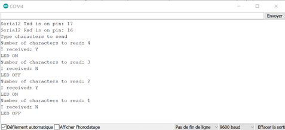

# Exercice complet

Maintenant que votre second ESP32 a son programme fonctionnel pour allumer la LED bleue avec un caractère Y, modifiez le code du premier ESP32 en remplaçant le fil « Touch sensitive » par une saisie de caractères au clavier (visualisée dans le moniteur série).

La saisie du caractère Y sera transmise au second ESP32 via l’UART2.

S’inspirer du programme Serial\_Turn\_LED.ino.

&#x20;

<figure><figcaption>
<em>Schéma de la communication série (avec moniteur série)</em>
</figcaption></figure>

&#x20;

Montage (idem que précédemment sans le fil "touch sensitive") :

&#x20;

<figure><figcaption></figcaption></figure>

Affichage pour la suite de caractères YNYN (ligne du haut puis envoyer ou Enter) :

<figure><figcaption></figcaption></figure>

Test : chaînes de caractères (petit jeu avec espace) : [https://plaisirarduino.fr/moniteur-serie/](https://plaisirarduino.fr/moniteur-serie/)
